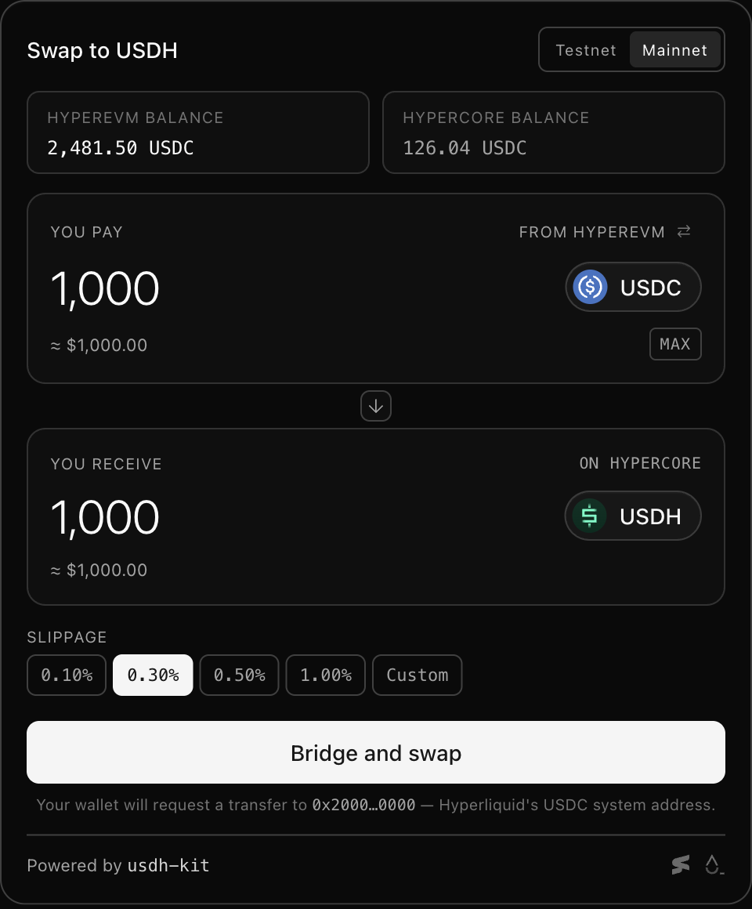

# usdh-kit

[](https://github.com/sumfxn/usdh-kit/actions/workflows/ci.yml)
[](./LICENSE)


<!--
  npm-dependent badges, intentionally commented until @usdh-kit/sdk and
  @usdh-kit/widget are published. Uncomment as part of the first npm
  publish PR.

  [](https://www.npmjs.com/package/@usdh-kit/sdk)
  [](https://www.npmjs.com/package/@usdh-kit/widget)
  [](https://www.npmjs.com/package/@usdh-kit/sdk)
  [](https://bundlephobia.com/package/@usdh-kit/sdk)
-->


TypeScript SDK for USDH on Hyperliquid.

USDH is the native stablecoin on Hyperliquid, issued by Bridge and designed by Native Markets, with 50% of reserve revenue routed to the Hyperliquid Assistance Fund. `@usdh-kit/sdk` ships the retail-side plumbing (pair resolution, signing, transport) so apps and bots can convert into USDH without writing the Hyperliquid action layer themselves. `@usdh-kit/widget` is an embeddable React component on top of the SDK so dapps can drop in a swap form in a few lines.

- **Source:** [github.com/sumfxn/usdh-kit](https://github.com/sumfxn/usdh-kit)
- **Builder gallery:** [`apps/demo`](./apps/demo) — SDK surfaces, live read-only market board, examples, and widget showcase.
- **Issues:** [github.com/sumfxn/usdh-kit/issues](https://github.com/sumfxn/usdh-kit/issues)
- **USDH:** [usdh.com](https://usdh.com) (issued by [Bridge](https://bridge.xyz), designed by [Native Markets](https://www.nativemarkets.com))
- **Hyperliquid:** [hyperliquid.xyz](https://hyperliquid.xyz) · [docs](https://hyperliquid.gitbook.io/hyperliquid-docs)

## Status

Pre-release. Public API is unstable until `1.0.0`.

What works today:

- `getQuote()` and `swap()` for `USDC → USDH` and `USDH → USDC` end to end
- `bridgeToCore()` for moving USDC from HyperEVM to HyperCore, with credit polling
- `bridgeFromCore()` for moving linked USDC/USDH spot assets from HyperCore to HyperEVM
- `getHypercoreBalance()` for spendable HyperCore balances (`total - hold`)
- `getRoute()` / `preflightSwap()` to choose direct HyperCore swap vs HyperEVM bridge
- `bridgeAndSwap()` for the common route → bridge → swap retail flow
- Hyperliquid agent-wallet support for browser-safe L1 order signing
- React widget with built-in source-chain selection (HyperEVM bridge or direct HyperCore swap), short-lived trading sessions, friendly errors, and full theming via CSS variables

Deferred to follow-up PRs:

- USDT pricing and swap (USDT/USDC/USDH double-hop)
- Multi-chain source via LiFi/Squid (Ethereum, Arbitrum, Base)

## Install

```sh
pnpm add @usdh-kit/sdk
```

For the React widget:

```sh
pnpm add @usdh-kit/widget wagmi viem @tanstack/react-query react react-dom
```

The widget depends on `@usdh-kit/sdk` internally. Install the SDK separately
only when your app imports SDK APIs directly.

## SDK quickstart

```ts
import { approveAgent, createUsdhKit } from '@usdh-kit/sdk'

// Browser apps should use an approved Hyperliquid agent wallet for L1 orders.
await approveAgent({
  network: 'mainnet',
  signer: masterWalletSigner,
  agentAddress: agentSigner.address,
  agentName: 'my-app-usdh',
  signatureChainId: 999,
})

const kit = createUsdhKit({
  network: 'mainnet',
  signer: agentSigner,
  accountAddress: masterWalletSigner.address,
  evmWallet,
  slippageBps: 30,
})

// quote
const amount = 11_000_000n // 11 USDC; Hyperliquid spot orders must be >10 USDC

const quote = await kit.getQuote({ from: 'USDC', amount })
console.log(`would receive ~${quote.estimatedReceived} USDH`)

// move USDC from HyperEVM to HyperCore (skip if already on HC)
const bridge = await kit.bridgeToCore({ asset: 'USDC', amount })

// swap on HyperCore via IOC limit at mid + slippageBps
const result = await kit.swap({ from: 'USDC', amount })
console.log(`got ${result.received} USDH for ${result.spent} USDC`)
console.log(`realised slippage: ${result.slippageBps}bps`)

// reverse direction on HyperCore
const reverse = await kit.swap({ from: 'USDH', to: 'USDC', amount: 11_000_000n })
console.log(`got ${reverse.received} USDC`)

// or let the SDK route, bridge if needed, then swap
const routed = await kit.bridgeAndSwap({
  from: 'USDC',
  amount,
  onProgress: (event) => console.log(event.phase),
})
console.log(`route: ${routed.route.sourceChain}`)
console.log(`order: ${routed.swap.orderId}`)
```

`swap()` submits an IOC limit order priced from the current mid: `USDC -> USDH` buys up to `mid + slippageBps`, while `USDH -> USDC` sells down to `mid - slippageBps`. The returned `result.slippageBps` is the realised slippage versus mid.

## Widget quickstart

The widget reads the connected wallet from wagmi. Wrap your tree in `WagmiProvider` and `QueryClientProvider` (e.g. via ConnectKit or RainbowKit), import the stylesheet once at your app root, then drop the component in.

```tsx
// app/layout.tsx (Next.js)
import '@usdh-kit/widget/styles.css'

// app/page.tsx
import { USDHSwap } from '@usdh-kit/widget'

export default function Page() {
  return <USDHSwap network="mainnet" />
}
```

The widget defaults to `theme="auto"` (follows the user's system). Force a palette with `<USDHSwap network="mainnet" theme="dark" />` or `<USDHSwap network="mainnet" theme="light" />`. Override any colour token from your own stylesheet — see [docs/theming.md](./docs/theming.md).

On first use, the widget asks the connected wallet to approve a short-lived Hyperliquid trading session. That agent signs only the HyperCore USDH order. If the route starts on HyperEVM, the connected wallet still submits the USDC approval/deposit transactions required for the Circle bridge.



## Use cases

A few real flows the SDK is shaped for today. Runnable examples are still on the roadmap; until they land, treat these as the integration targets to copy into your own app.

- **End-to-end CLI** — bridge + quote + swap from a private key on the command line. Smallest possible integration.
- **Discord bot** — slash command that quotes `USDC → USDH`, confirms the route, then calls `bridgeAndSwap()` with progress updates.
- **Subscription billing** — collect or rebalance USDC into USDH from a merchant wallet after a payment webhook.
- **Treasury rebalance** — scheduled job that converts a fraction of HyperCore USDC above a floor into USDH. Designed for cron.

## Features (V1)

- `USDC → USDH` quote and swap via the canonical HL spot pair
- `USDH → USDC` reverse swap on HyperCore
- HyperEVM → HyperCore bridge with credit polling (`bridgeToCore`)
- HyperCore → HyperEVM bridge-out for linked USDC/USDH spot assets (`bridgeFromCore`)
- HyperCore balance, route/preflight helpers plus `bridgeAndSwap()` orchestration
- Experimental read-only outcome market metadata, books, and mids
- USDH-only spot order helpers for placing, cancelling, and reading USDH-pair orders
- Wallet-agnostic `Signer` interface (works with viem, ethers, Privy, Turnkey, raw private key)
- Approved Hyperliquid agent wallet flow for browser apps (`approveAgent`, `accountAddress`)
- Read-only `InfoClient` (spotMeta, outcomeMeta, spot clearinghouse state, L2 book, allMids) for consumers building custom UIs
- Typed error hierarchy rooted at `UsdhKitError`, including `BridgeAndSwapError` phase/cause context and `isBridgeAndSwapError()` for orchestration failures
- `friendlyError()` helper to map SDK errors to short, copy-safe strings
- React widget (`@usdh-kit/widget`) with light, dark and auto theming (WCAG AA defaults, CSS variables for integrator overrides)
- npm provenance on every release
- Mainnet and testnet support, no signing on read paths

## Docs

- [docs/architecture.md](./docs/architecture.md) — what the SDK does under the hood, in the order it does it (msgpack, signing, bridge polling, error model).
- [docs/agent-wallets.md](./docs/agent-wallets.md) — secure signing patterns for builders: backend agent, browser trading session, externally managed signer.
- [docs/bridge-and-swap.md](./docs/bridge-and-swap.md) — the full USDC HyperEVM → USDH HyperCore flow, including wallet prompts and recovery.
- [docs/glossary.md](./docs/glossary.md) — Hyperliquid terms used across the SDK and widget (HyperEVM vs HyperCore, IOC, system address, weiDecimals, …).
- [docs/theming.md](./docs/theming.md) — widget CSS variable list, override patterns, SSR-flash mitigation, Tailwind setup.
- [docs/troubleshooting.md](./docs/troubleshooting.md) — common errors with concrete fixes (`MissingEvmWalletError`, `BridgeTimeoutError`, "borders render bright white", …).

## Runtime support

- Node.js >= 18.18 (native `fetch`, `AbortController`, `bigint`)
- Bun >= 1.1
- Modern evergreen browsers (Chrome >= 107, Safari >= 16, Firefox >= 104)
- Edge runtimes (Cloudflare Workers, Vercel Edge)

Consumers targeting older environments must downlevel via their bundler.

## Why USDH

Hyperliquid's primary stable was USDC, bridged from Arbitrum. USDH is native, fully reserved (cash plus US Treasuries), and routes 50% of reserve revenue to the Assistance Fund instead of an issuer. Apps that hold or pay out stables on Hyperliquid have a reason to prefer USDH; this SDK removes the friction.

## Contributing

See [`CONTRIBUTING.md`](./CONTRIBUTING.md). Security disclosures: [`SECURITY.md`](./SECURITY.md).

## License

[MIT](./LICENSE)
